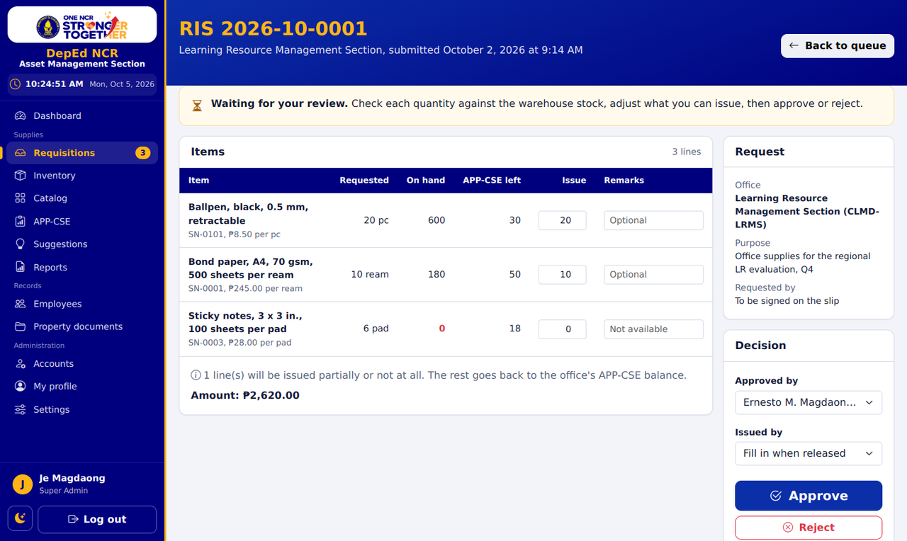
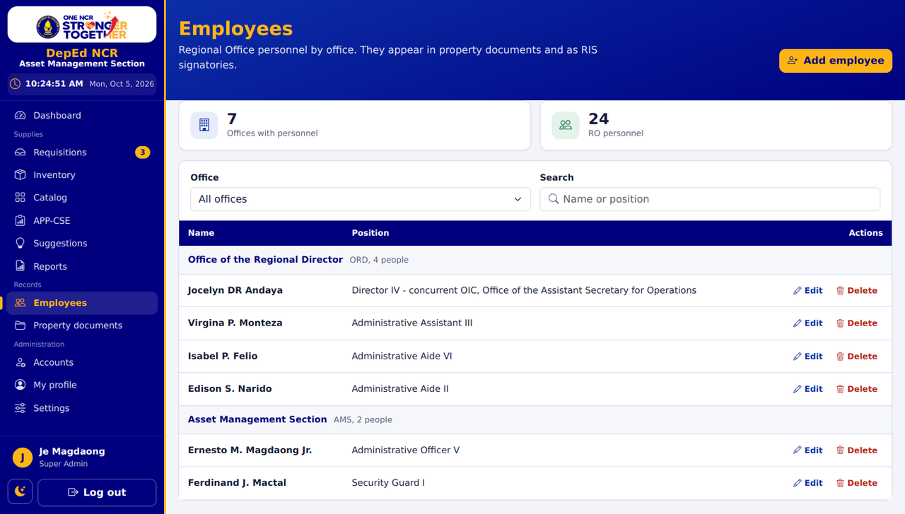
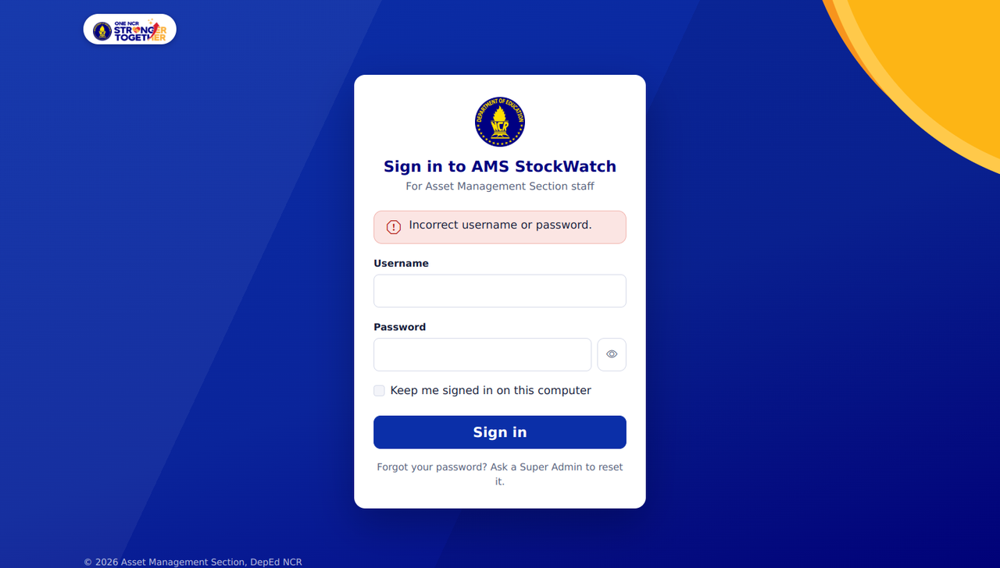
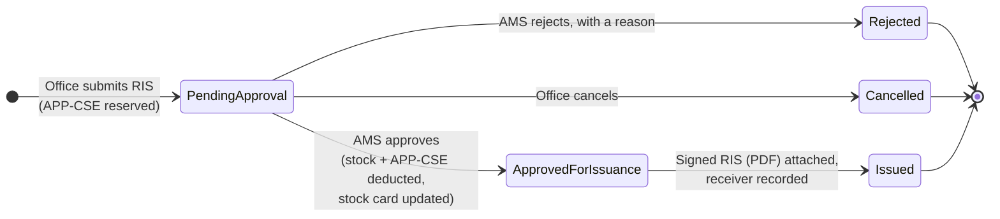

<p align="center">
  
</p>

<p align="center">
  
  
  
  
  
  
</p>

<p align="center">
  <b>The Asset Management Section's side of the DepEd NCR supply system.</b><br>
  Approve and issue office requisitions, keep the warehouse count and stock cards right,
  load each office's APP-CSE from Excel, and produce the RSMI and other reports.
</p>

<p align="center">
  <a href="https://github.com/Oshinobi-obi/AMS_Shopee">AMS Supplies (office portal)</a> ·
  <a href="#getting-started">Run it locally</a>
</p>

---

## What AMS can do

| Area | Highlights |
|---|---|
| **Dashboard** | Requisitions waiting, low and out-of-stock items, documents and personnel at a glance |
| **Requisitions** | Queue by status; review each RIS beside live warehouse stock and the office's remaining APP-CSE; **partial issue**; approve or reject with a reason, all with confirmations |
| **Release** | Record who received the items and **attach the wet-signed RIS (PDF)**. Required before *Issued*, and shared with the office |
| **Inventory** | Receive deliveries (IAR / DR no.), adjust with a reason, total value on hand, and a **stock card** per item (Excel / print) |
| **Catalog** | Items, prices, photos, low-stock levels, categories and suppliers; hide items without losing history |
| **APP-CSE** | Download an Excel template already filled with current figures; upload; every row is checked and previewed before anything is saved |
| **Suggestions** | Review "Suggest a supply" requests from offices: added to catalog, for next APP, or declined |
| **Reports** | **RSMI** with recapitulation, **APP-CSE utilization**, **reorder list**, all exportable to Excel |
| **Records** | RO personnel by office; PAR, ICS and return slips (PDF) with filters and bulk download |
| **Administration** | Staff and office accounts, password resets shown once with a copy button, activity log, settings for the RIS header and default signatories |

**Also:** live updates and a sound when a new requisition arrives, desktop notifications, light and dark mode, a live Philippine-time clock, and a sidebar that becomes a slide-out menu on phones.

## Screenshots

<p align="center">
  
</p>

<table>
  <tr>
    <td width="50%">
      <picture>
        <source media="(prefers-color-scheme: dark)" srcset="docs/screenshots/requisition-review-dark.png">
        
      </picture><br><sub><b>Requisition review:</b> stock and APP-CSE beside every line.</sub>
    </td>
    <td width="50%"><br><sub><b>Employees:</b> RO personnel, used as RIS signatories.</sub></td>
  </tr>
  <tr>
    <td colspan="2" align="center"><br><sub><b>Sign in:</b> AMS staff only.</sub></td>
  </tr>
</table>

<sub>Screenshots show sample data.</sub>

## The approval flow



Approval runs in one database transaction with row locks shared with the office portal, so two people can never issue the same stock or the same APP-CSE balance twice.

## Tech stack

| Layer | Used |
|---|---|
| Web app | ASP.NET Core **.NET 10**, Blazor Web App (**Interactive Server**) |
| Data | **MySQL 8.0.16+**, Entity Framework Core 9 with Pomelo, `IDbContextFactory` per operation |
| Excel | **ClosedXML**: APP-CSE template and import, RSMI, utilization, reorder list, stock cards |
| Sign-in | Cookie authentication, **bcrypt**, antiforgery, per-IP rate limit, lockout, forced password change, sessions re-checked every 5 min |
| UI | Bootstrap 5.3 and Bootstrap Icons, served locally (works without internet), DepEd NCR design system |
| Hosting | IIS (MonsterASP.NET), HTTPS, sign-in keys stored in MySQL |

## Project structure

```text
AMS_Storage_and_Report_System/
├─ Components/
│  ├─ Layout/        AppLayout (sidebar), LiveNotifier, EmptyLayout
│  ├─ Pages/         Dashboard, Requisitions, RequisitionReview, RequisitionPrint, Inventory, StockCard,
│  │                 Catalog, AppCse, Suggestions, Reports, Employees, PropertyDocuments,
│  │                 Account, Profile, Settings, Login
│  ├─ Requisition/   RisDocument (Appendix 63)
│  └─ Shared/        Dialog, Picker, PageHeader, Modals, ThemeToggle, PhClock
├─ Data/             AppDbContext (hand-mapped to the shared ams_stockwatch schema)
├─ Models/           Users, offices, personnel, property documents, supplies, RIS
├─ Services/         RequisitionAdmin, Stock, Catalog, AppCse, Report, Settings, Auth, Live, Security
└─ wwwroot/          css/admin.css, css/ris.css, js/, lib/ (Bootstrap, icons), images/, sounds/
```

## Getting started

### 1. Requirements
* [.NET 10 SDK](https://dotnet.microsoft.com/download)
* MySQL **8.0.16 or newer**
* The **database scripts** from the [AMS Supplies repository](https://github.com/Oshinobi-obi/AMS_Shopee/tree/master/AMS_Shopee/Database). Both websites share one database.

### 2. Database
Run `Database/000_base_schema.sql` (new databases only), then `001` → `006` in order. The starter account from `000` is:

| Username | Temporary password |
|---|---|
| `superadmin` | `ChangeMe@2026` (you must choose a new one at the first sign-in) |

### 3. Connection string (never in Git)
```bash
cd AMS_Storage_and_Report_System
dotnet user-secrets set "ConnectionStrings:Default" "server=localhost;port=3306;database=ams_stockwatch;user=YOUR_USER;password=YOUR_PASSWORD;"
```

### 4. Run
```bash
dotnet run
```
The site opens at the sign-in page. Then set up in this order: **Catalog → Inventory** (opening stock) **→ Employees → Settings → APP-CSE → Accounts** (one per office).

## Configuration

| Setting | Where | Purpose |
|---|---|---|
| `ConnectionStrings:Default` | User Secrets (dev) / `appsettings.Production.json` (server) | MySQL connection |
| `https_port` | `appsettings.Production.json` | Redirects `http://` to HTTPS (usually `443`) |
| `DataProtection:UseDpapi` | `appsettings.Production.json` | Set to `false` on shared hosts that don't allow Windows DPAPI |
| `Auth:AllowHttpCookies` | `appsettings.Production.json` | **Temporary** switch for a server without SSL. Keep it off |
| `Storage:PropertyDocumentsPath` | `appsettings.json` | Folder for PAR / ICS / return-slip PDFs (default `App_Data`) |

## Deployment (MonsterASP.NET)
1. Run the database scripts on the hosted database.
2. Create `appsettings.Production.json` with the hosted connection string, `"https_port": 443` and `"DataProtection": { "UseDpapi": false }`.
3. Publish with this site's own Web Deploy profile, turn on **SSL / Force HTTPS**, then restart the site.

## Security at a glance
* Parameterized SQL everywhere, so typed text can't change a query.
* bcrypt password hashes; 5 wrong tries lock an account for 15 minutes; at most 40 sign-in attempts per IP every 5 minutes.
* Staff-only sign-in; Super Admin-only account management; forced password change on first sign-in.
* Sessions are re-checked every 5 minutes; "Keep me signed in" lasts at most 7 days.
* HTTPS-only cookies, security headers, safe file paths, and sign-in keys encrypted at rest where the host allows it.

## Related
* **[AMS Supplies](https://github.com/Oshinobi-obi/AMS_Shopee)**, the office portal: catalog, cart and RIS, My requisitions, My APP-CSE.

---

<p align="center">
  <sub>Built for the <b>Asset Management Section, DepEd NCR</b> by <a href="https://github.com/Oshinobi-obi">Oshinobi</a>. For internal use of the Regional Office.</sub>
</p>
